<h1 align="center">Tailwind CSS Installation - Lesson2</h1>

### Table of Contents

- [Installation](#installation)
  - [Summary](#summary)
  - [Shortcut](#shortcut)

## Installation

আমরা মূলত তিনভাবে tailwind CSS ইন্সটল করতে পারি।

1. Install from CDN
2. Install as PostCSS plugin
3. Install Tailwind CLI

- আমাদের html ফাইলে cdn link বসিয়ে দিয়ে। কিন্তু সেক্ষেত্রে আমরা tailwindcss কে customize করতে পারবো না।

- tailwindcss কে postCSS plugin হিসেবে install করতে পারি। বিগিনারদের জন্য এই process টা একটু কঠিন হতে পারে। (lesson3)

- সহজ হিসেবে আমরা আমাদের প্রজেক্টে Tailwind CLI(command line interface) install করে নিতে পারি। এতে করে আমরা command line দিয়ে ব্যবহার করতে পারব। এবং tailwindcss install করার জন্য এটিই হচ্ছে best approach. তবে এটার একটু prerequisites রয়েছে। আর সেটি হলো মেশিনে node js >= 12.3.0 থাকতে হবে।

(i) টার্মিনালে `node -v` লিখে node js এর ভার্সন চেক করে নিব।
(ii) আমরা আমাদের টার্মিনালে `npm init -y` লিখে একটি নোট প্রোজেক্ট ইনিশিয়ালাইজ করে ফেলব।
(iii) এরপর আমরা `npm i -D tailwindcss` লিখে tailwindcss কে developer dependence হিসেবে ইন্সটল করে নিব।
(iv) এবং সেই সাথে আমাদের কাজের সুবিধার জন্য আমরা আমাদের vs code এডিটরে এ tailwind CSS IntelliSense নামে একটি প্লাগিন ইন্সটল করে নিব।
(v) এরপরে আমাদের কাজ হচ্ছে tailwindcss এর জন্য একটি কনফিগারেশন ফাইল বানানো। টার্মিনালে `npx tailwindcss init` এই কমেন্ট লিখলেই আমাদের প্রজেক্ট এর মধ্যে tailwind.config.js নামে একটি ফাইল তৈরি হয়ে যাবে। এই ফাইলে আমরা tailwind সম্পর্কিত সকল ধরনের configuration এবং customization রিলেটেড কাজ করতে পারব।
(vi) এবারে আমরা আমাদের প্রজেক্টে src(source) এবং dist or output নামে দুটি ফোল্ডার তৈরি করব। tailwind এর কাজ কারবার আমরা src ফোল্ডারের ভিতরে করব এবং dist or output ফোল্ডারের ভিতরে tailwind আমাদেরকে তার কম্পাইলারের সাহায্যে vanilla css তৈরি করে দিবে। একদম raw css.
(vii) src ফোল্ডারের ভিতরে styles.css নামে একটি ফাইল তৈরি করব। তবে এখানে styles.css নামেই তৈরি করতে হবে এমন কোন কথা নাই। আমরা যে কোন নামেই ফাইল তৈরি করতে পারি।
(viii) ফাইলটা তৈরি করার পরে সেই css ফাইলে আমরা এই তিনটা লাইন লিখব:

```css
@tailwind base;
@tailwind components;
@tailwind utilities;
```

- @tailwind তো css এর কোন প্রপারটি না, তাহলে এটা কিভাবে আমরা css ফাইলে লিখলাম?
  well, এই @ কে বলা হয় directive. যখন আমরা tailwind.css ফাইলটা tailwind দিয়ে কম্পাইল করব, তখন এই directive গুলো দেখেই tailwind বুঝতে পারবে যে, এখানে tailwind এর base স্টাইল গুলোকে import করতে হবে।
- তারপরে কম্পনেন্ট কে base যে স্টাইল গুলো আছে সেগুলোকে import করবে
- এবং সবশেষে utilities স্টাইলগুলো import করে নিয়ে আসবে।

(ix) এরপরে আমরা আমাদের এই প্রজেক্টের রুট ফোল্ডারের ভিতরে .vscode নামে একটি ফোল্ডার এবং তার ভিতরে settings.json নামে একটি ফাইল নিব। এটা হল আমাদের প্রজেক্ট এর জন্য vs code এর কিছু কাস্টম সেটিং লেখা ফাইল। যেহেতু tailwindcss এর কোড গুলো vs code চিনতে পারবে না কারণ এগুলো tailwind এর ভাষা, css না! তাই আমাদের এডিটরে যেন error বা warning না দেখায় সেজন্য আমরা settings.json ফাইলে প্রথমে এডিটরের ডিফল্ট css.validate সেটিংটাকে অফ করে নিব। তাহলে এডিটর tailwind এর কোড গুলোর জন্য warning দিবেনা। এছাড়া আমরা একটু আগে যে tailwind intelligence প্লাগিনটা ইনস্টল করেছি, সেই প্লাগিনের emmetCompletions সেটিংটি আমরা অন করে নিব; যেন আমরা এডিটরের টেপ চেপে চেপে html emmet প্লাগিনের মত auto completion পাই।

```json
{
  "css.validate": false,
  "tailwindCSS.emmetCompletions": true
}
```

(x) এর আগে আমরা source ফোল্ডারের ভিতরে tailwind.css এর ডিরেকটিভ লিখে tailwind এর কিছু স্টাইল import করেছিলাম। এখন সেই স্টাইলগুলো একচুয়াল css কোডে কম্পাইল করার জন্য আমাদের build script লিখতে হবে। এজন্য আমরা আমাদের package.json ফাইলে scripts প্রোপার্টির ভিতরে build নামে একটি প্রোপার্টি লিখব এবং সেই প্রোপারটির ভ্যালুতে দিব `"npx tailwindcss -i ./src/styles.css -o ./dist/tailwind.css --watch"`
এখানে -i মানে হচ্ছে input. অর্থাৎ আমরা ইনপুট হিসেবে কোন ফাইটা দিব, সেটা আমাদের দেখিয়ে দিতে হবে। -o মানে output…………
–watch(or -w) লিখার কারণ: যখনই. /src/styles.css ফাইলে কোনো আপডেট বা মডিফিকেশন করব, তখন automatically build হয়ে যাবে।
(xi) build script run করার পরে আমরা যে output ফাইলটা পাব সেটি আমরা আমাদের index.html এর সাথে লিংক করে দিব।

```html
<link rel="stylesheet" href="../dist/tailwind.css" />
```

(xii) এখন আমরা build করার জন্য প্রস্তুত। আমরা আমাদের টার্মিনালে `npm run build` কমান্ড লিখলেই tailwind build হবে। অর্থাৎ আমরা এখন টেলিন ব্যবহার করে awesome awesome site design করার জন্য একদম রেডি।😊

## Summary

1. Check node verson (node -v)
   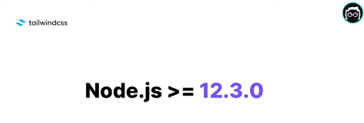 .
    .
2. npm init -y
   
3. npm i -D tailwindcss
   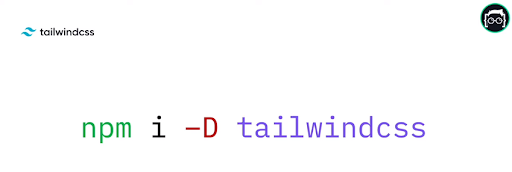
4. Install Tailwind CSS InteliSence vs code plugin
   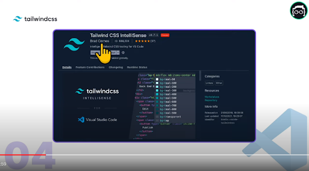
5. npx tailwindcss init and Add the paths to all of your template files in your **tailwind.config.js** file.
   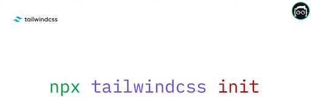
   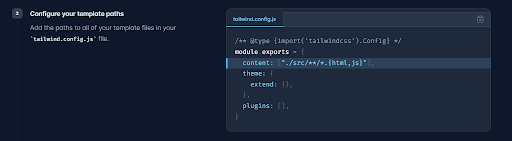
6. Create src and dist folder in root
   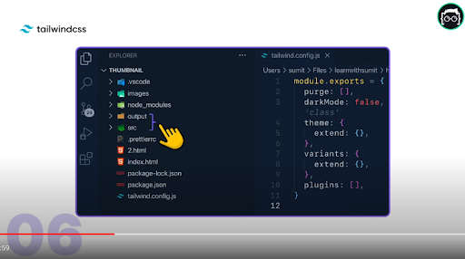
7. Create src/styles.css file
   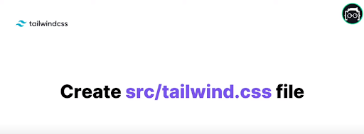
8. Paste below code in src/styles.css
   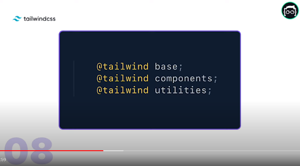

```css
@tailwind base;
@tailwind components;
@tailwind utilities;
```

9. Create .vscode/settings.json in root and type
   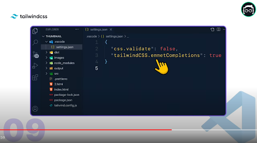

```json
{
  "css.validate": false,
  "tailwindCSS.emmetCompletions": true
}
```

10. Write this code `"build" : "npx tailwindcss -i ./src/styles.css -o ./dist/tailwind.css -w"` in package.json’s scripts property.
    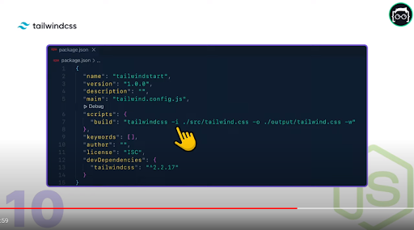
11. Link in html file
    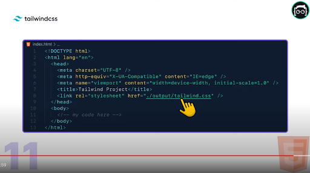
12. Type `npm run build` in tarminal and press enter
    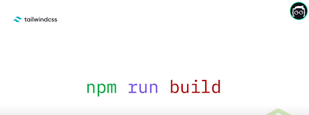
13. Output in browser.
    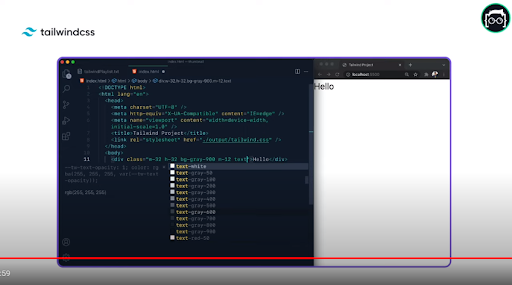
    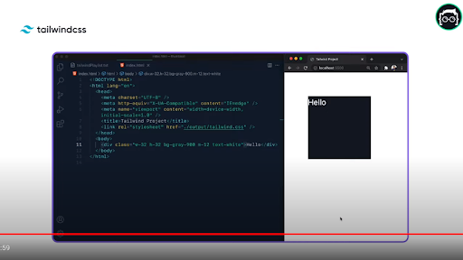

## Shortcut:

🚀🚀🚀 Environment set up shortcut:

1. `npm init -y`
2. `npm i -D tailwindcss`
3. npx tailwindcss init and add `content: ["./src/**/*.{html,js}"]` in **tailwind.config.js**
4. Create `./src/styles.css` and paste ( @tailwind base; @tailwind components; @tailwind utilities; )
5. Create `.vscode/settings.json` in root and type { “css.validate”: false, “tailwindCSS.emmetCompletions”: true}
6. Write this code ( “build” : “npx tailwindcss -i ./src/styles.css -o ./dist/tailwind.css -w”) in package.json’s scripts property.
7. Link in html file
