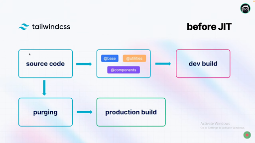
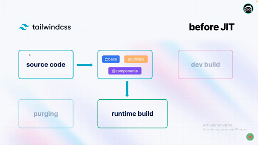

 
 

    <h1 align="center">  Just in Time - Advanced Concepts - Lesson14</h1>

<!-- TABLE OF CONTENTS -->

## Table of Contents

- [Just-in-Time](#just-in-time)

 

# Just-in-Time

আগের classic engine টা just-in-time দ্বারা replace হয়ে গেছে।
রান টাইমে(সময় মত) build করতে পারে। lightening fast build দিবে সে। আমরা এখন চোখের নিমিষে আউটপুট দেখতে পাবো।

- lightening fast build
- Stackable variants
- Abitary value support

আগে বিশাল বড় file size তৈরি হতো। যেটাকে file size ballooning problem বলা হতো। এখন এই problem টা থাকবে না।

- Before JIT

- After JIT

  

 
