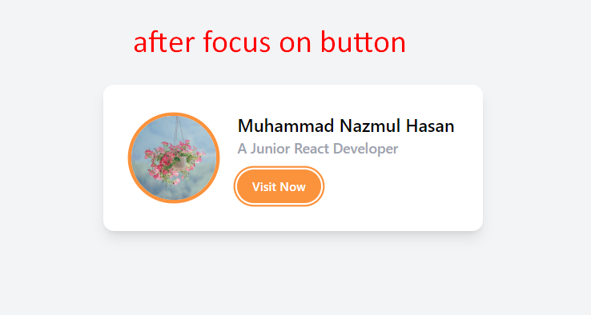
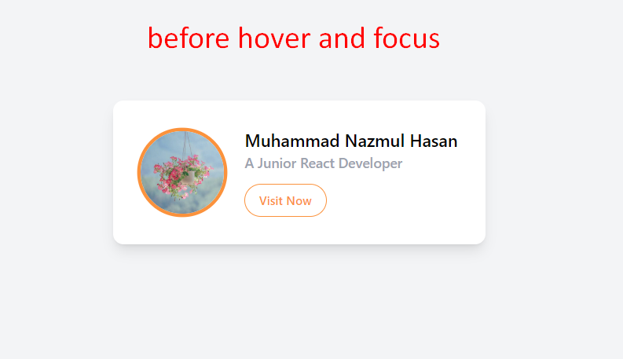

<br />
 <p align="center">
    <h1 align="center">Responsive Varients and Tailwind Breakpoints - Lesson4</h1>
</p>

<!-- TABLE OF CONTENTS -->

## Table of Contents

- [Output](#output)
- [How to run](#how-to-run)

<br>

## Output




<!-- HOW TO RUN -->

## How to run

Please follow the below instructions to run this branch in your machine:

1. Clone this repository -
   ```sh
   git clone https://github.com/Nazmul1582/tailwindcss.git
   ```
2. Go to the cloned project directory
   ```sh
   cd tailwindcss
   ```
3. Checkout/switch to branch lesson4
   ```sh
   git checkout lesson4
   ```
4. Then run the index.html file with Visual Studio Code Live Server plugin.

<br>
