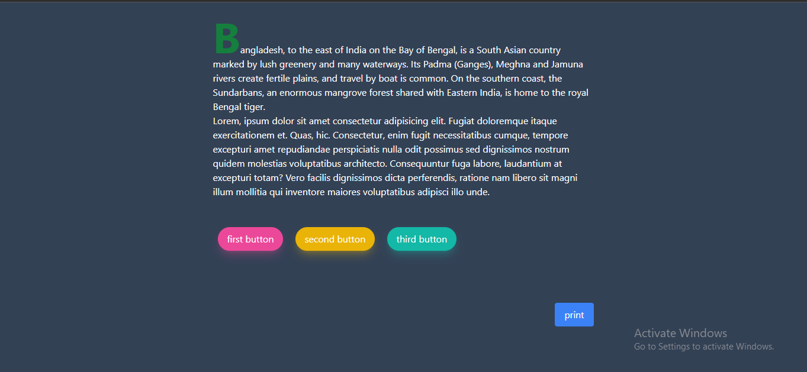
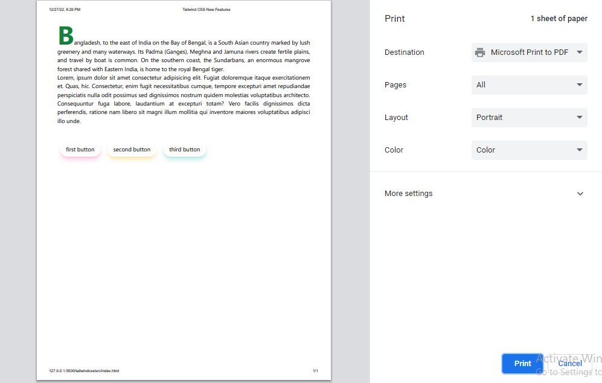
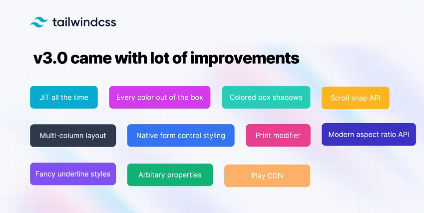

 
 

    <h1 align="center">  Tailwind CSS New Features</h1>

<!-- TABLE OF CONTENTS -->

## Table of Contents

- [Tailwind CSS New Features](#tailwind-css-new-features)

 

# Tailwind CSS New Features

- Before JIT

- After JIT

  

 
